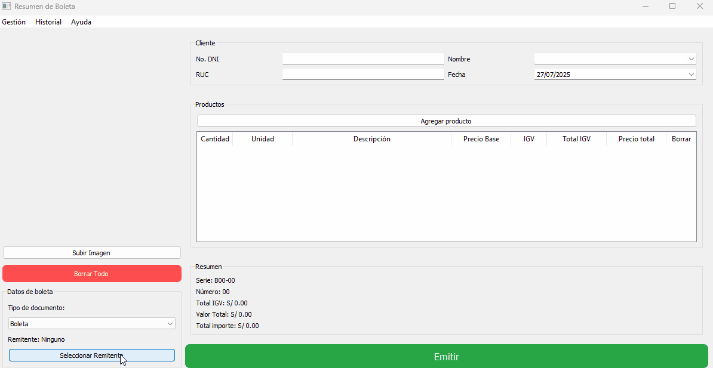

## SISTEMA DE FACTURACIÓN AUTOMATIZADA  
[Ir a la Demo](#demo)

El proceso de emitir imagenes de boletas y facturas electrónicas, convertir importes afectos al IGV, y subir los comprobantes al sistema de SUNAT suele ser lento y repetitivo cuando se realiza de manera manual. Además, implica el uso de múltiples cuentas, formularios y validaciones.

Este proyecto automatiza dicho flujo de trabajo mediante técnicas de Web Scraping, Inteligencia Artificial y una interfaz gráfica intuitiva, reduciendo tiempos y mejorando la eficiencia del proceso.

## 🚀 FUNCIONALIDADES PRINCIPALES
- Gestión de productos: visualización de precios y stock disponibles por remitente.
- Búsqueda inteligente: recomendación de los 5 productos más similares al término buscado.
- Generación de comprobantes: agregar productos de manera dinámica y generar el comprobante.
- Envío automatizado a SUNAT: carga automática del comprobante al sistema oficial.
- Selección de remitente: asignación rápida y precisa del emisor.
- Descarga de comprobante: exportación inmediata del comprobante en formato PDF.
- Reportes de ventas: generación de reportes con gráficos estadísticos.

## TECNOLOGÍAS UTILIZADAS

- Python 3 – Lógica principal y backend.
- Selenium – Automatización y scraping del sistema SUNAT.
- RapidFuzz – Búsqueda y recomendación inteligente de productos.
- Tkinter – Interfaz gráfica de escritorio.
- SQLite – Base de datos local liviana.
- Matplotlib – Visualización de reportes y análisis de datos.

## Requisitos

- Python 3.11.1 o superior
- pip (gestor de paquetes)

## INSTALACIÓN Y EJECUCIÓN

1. Clonar este repositorio o descomprimir el archivo .zip del proyecto.
2. Instalar dependencias (se recomienda un entorno virtual):

   pip install -r requirements.txt

3. Ejecutar la aplicación:

   python main.py

## Demostraciones

Demostración rápida:

Interfaz de usuario:

## 📋 Mejora futura

- Integración directa con los servicios oficiales de facturación electrónica de SUNAT.
- Exportación de datos a Excel y Google Sheets.
- Sistema de autenticación con control de acceso por roles.
- Respaldos automáticos de la base de datos.
- Soporte multiusuario orientado a contadores.

## 👨‍💻 AUTOR

- Jefersson Quicaña Erquinio
